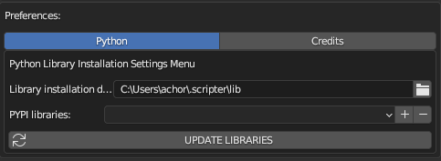

# Scripter

Blender addon for using python PYPI packages.

---

### Overview

Scripter is simple addon that allows you to install and use python libraries (packages) that are not normally given with Blender. The addon lets you to install packages from PYPI [https://pypi.org/] and adds them automatically at each next Blender start (they are not purged as usuall).

### Installation

Addon installation is simple as always. Just download the release, then in Blender click `Edit -> Preferences`. In `Add-ons` click install and chose the scripter.zip file.

### How to use

All you need to do is to add `PYPI libraries`, click `UPDATE LIBRARIES` and then wait for a while to install them.

NOTE! While installing, Blender is not responsive for some time. It is recommended to open Blender's console window (`Window -> Toggle System Console`) for installation observation. 

### Contribution and testing

Test status: Addon was tested on Blender 3.3 and 3.6. It is known issue it sometimes crashes after installation of new packages (while they are available after reopening Blender)

Please feel free to contribute with addon development.

---

Copyright (C) 2023 Arkadiusz Choruzy aka inDustArk